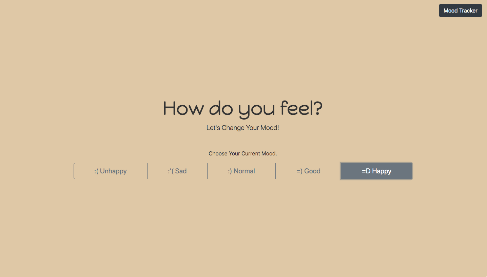
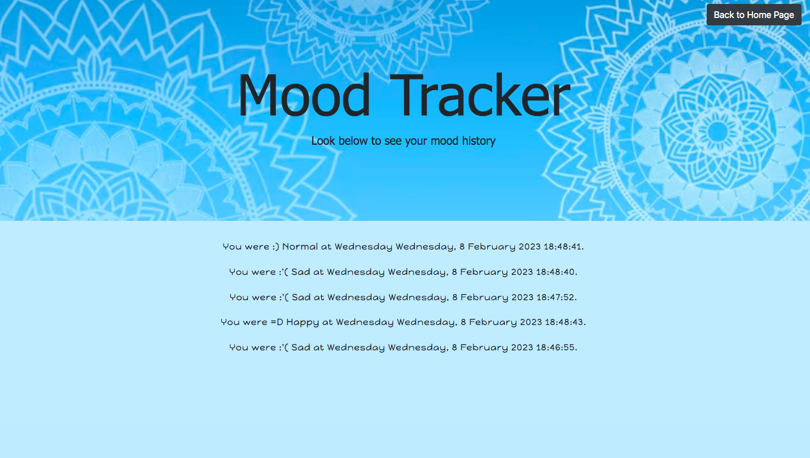

# Mood-Shift
## Description

The project is designed to improve mental wellbeing. The purpose of the site is to track your current mood, and help improve your mood with guided assistance, such as guided meditation videos, relaxing audio and informative articles. The project combines all the knowledge aquired over the bootcamp, using HTML, CSS, Bootstrap, Jquery as well as using server APIs and third-party APIs. The criteria of the project was to:
-Use Bootstrap.
-Be deployed to GitHub Pages.
-Be interactive (in other words, accept and respond to user input).
-Use at least two server-side APIs Links to an external site..
-Does not use alerts, confirms, or prompts (use modals).
-Use client-side storage to store persistent data.
-Be responsive.
-Have a polished UI.

## Installation

The site is designed using bootstap. It also calls multiple third-party APIs. The APIs used for the site are Youtube, Wikipedia and Deezer, which are used to provide the mood changing media options for the site. 

## Usage

When the page is opened, you are prompted with a question about how you are feeling today. After the user has selected the button representing their current mood from the options given, the data is stored. This data can be accessed in the navigation bar, which leads to another HTML page. This page stores all the users inputs and records the date the data was selected to work as a mood tracker. When the buttons on the index page are double clicked, the page moves down to the next question, which provides a series of prompts asking the user how they would like to feel. This will determine whether the site brings forward happy or relaxing content to support the user in shifting their mood. Lastly, the last question asks the user what sort of content they would like to see. The options provided is audio, video or article. When the button is clicked, the API is called and the correct media content is brought forward and displayed on the site. The following images show the functionality of the page. 

This is the url for the GitHib repository: https://github.com/KianaMsqt/Mood-Shift.git
This is the url for the deployed site: https://kianamsqt.github.io/Mood-Shift/index.html 

## Credits

The project has three collaborators with their github user names listed:

Kiana Masqati: @kianamsqt
Sam Hendry: @sdjhen
Shaz Kawa: @shazzy-kawa

The project uses 3 third-party APIS:

YouTube API: https://www.googleapis.com/youtube/v3/search?part=snippet&q=+&type=video&key=
Deezer API: https://api.deezer.com/search/track
Wikipedia API: "https://en.wikipedia.org/w/api.php" 

## Tests

As the project has multiple collaborators, each induviduals work was deployed onto their own seperate branch.Once their induvidual code has been tested and is ready to be put into the final site, the branch was then merged onto demo branch. The demo branch acts as a secondary main branch to test all collaborated work together and test the functionality of the site. Once the demo was up to standard, all work from the demo branch was then merged onto the main branch ready for deployement. 
